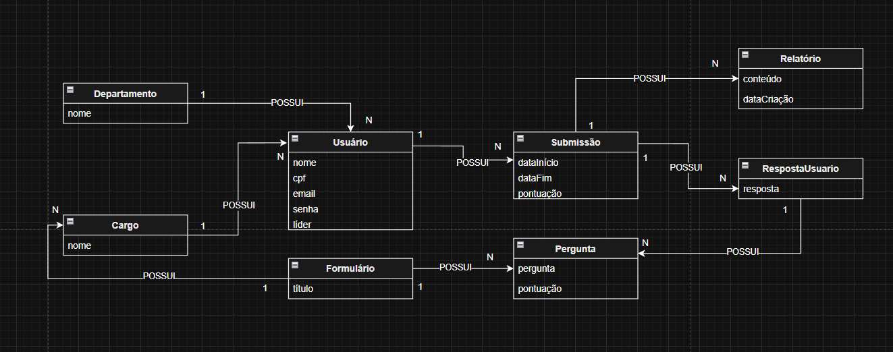
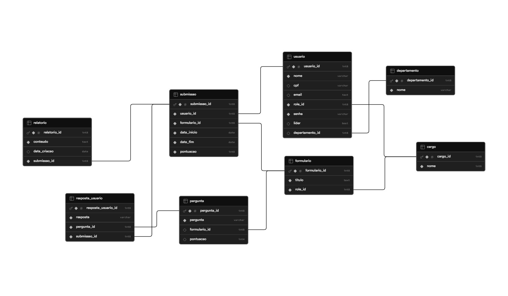

# AZUOS - Liderença Ética

---

**FIRJAN SENAI SESI - Petrópolis/RJ**   `2026`  
### Desenvolvedores:
- [Gabriel Toledo Melo](https://github.com/F12-Melo): <gabrieltoledomelo12@gmail.com>;
- [João Victor Demarchi Leite](https://github.com/Demarchi11): <joaodemarchi487@gmail.com>;
- [Mathias Basílio Hammes de Souza](https://github.com/Mathias-hackerman): <mbasiliohammes@gmail.com>;
- [Nicolas Esteves Caetano Moreira](https://github.com/Nicolaspity): <nicolas.e.moreira@gmail.com>;
- [Thiago Coelho Tesch](https://github.com/Thiagotesch7): <thiagotesch7@gmail.com>;

### Demanda da Indústria SAGA SENAI de Inovação
- [SISTEMA DE GERENCIAMENTO DE AVALIAÇÕES COMPORTAMENTAIS](https://plataforma.gpinovacao.senai.br/plataforma/demandas-da-industria/interna/12365?authuser=1)  
---

## Sobre o projeto
### Contextualização do projeto:
- Na sociedade brasileira, observa-se o despreparo e a desqualificação de lideranças ligadas e alinhadas a um modelo de governança e gestão ética.
- Essa problemática já é reconhecida e evidenciada pelas necessidades ESG de governança  corporativa. Ademais, o engajamento dos funcionários, segundo Relatório do Local de Trabalho 2025 do Gallup, depende cerca de 70 % da liderança e do engajamento do líder. 
- Em 2024, o desengajamento, que acarreta diretamente na eficiência e produtividade dos funcionários, caiu 21% em relação relação ao ano passado, causando um prejuízo de mais de 400 bilhões de reais mundialmente.

### Apresentação do projeto:
- Nosso projeto visa uma plataforma de formação continuada que busca aprimorar a liderança ética e a prática de compliance, unindo a esfera técnica à esfera gestora. Assim, nossa plataforma tem como objetivo o uso da IA no ambiente corporativo como ferramenta de aperfeiçoamento profissional. 

### Objetivos específicos do projeto: 
- Analisar, avaliar, capacitar, aperfeiçoar e aconselhar líderes éticos;
- Maximizar eficiência e produtividade de empresas, organizações e funcionários;
- Democratizar o conhecimento acerca de Complience e Governança Ética;
- Garantir acompanhamento integral aos líderes perante a Diretoria Executiva ou Corpo Administrativo Superior da empresa.

---

## Metodologia

- Adquirimos conhecimento em Python, API's, Banco de dados e Agdente de IA.
- Criamos um sistema utilizando como Agente o Google SDK que avalia habilidades, engajamento, produtividade e atuação ética dos usuários através do formulário analisado. 
- Melhoria do sistema em conformidade com a Demanda da Industria no Saga Senai Inovação, com adição de ranking dos usuários da empresa e divisão dos níveis de ética por cores: azul (acima da expectativa), verde (dentro da expectativa), amarelo (abaixo da expectativa) e vermelho (crítico). 

---

## Tecnologias usadas

### Front-End
   -   

### Back-End
   -  

### Banco de Dados
   -  

## Modelagem de Sistemas em Desenvolvimento
- Modelagem Conceitual (drawio)

- Modelagem Lógica (pupabase)

---

  

    Agradecimento especial ao nosso ilustre e primeiro instrutor do Senai:
   

  

    <strong>
      <em>"Um dia nunca antes vivido e que nunca mais se repetirá"</em>
    </strong>
     
    – Luciano Moreira –
  

