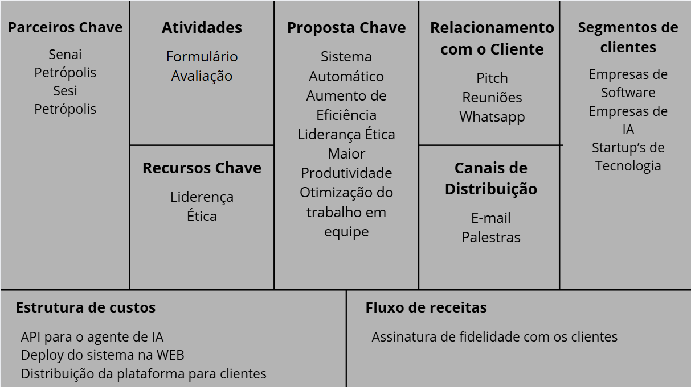

# Sites de Pesquisa
---

### Backend
- https://docs.langchain.com/
- https://ai.google.dev/gemini-api/docs/quickstart?hl=pt-br
- https://www.hackerrank.com/dashboard
- https://awsacademy.instructure.com/courses/147766
- https://gemini.google.com/gem/1LeYa6nvfhzqcWmTuloJuODIcV6x0PASM?usp=sharing

### Lideranças, IA, Ambientes Loborais
- https://www.gov.br/trabalho-e-emprego/pt-br/acesso-a-informacao/participacao-social/conselhos-e-orgaos-colegiados/comissao-tripartite-partitaria-permanente/normas-regulamentadora
- https://portal.fgv.br/
---

### Pesquisar esses assuntos

- IA e o futuro do trabalho; nossa plataforma pode ensinar e aperfeiçõar a relação entre funcionários e essa tecnologia 
- Redes Neurais, Engenharia de Prompt, Letramento em IA, Ética Aplicada, Inteligência emocianal e Comunicação
- Gestão de Risco, Governaça e Trabalho em Equipe

# Baby Canva

- Baby Canva Inicial

